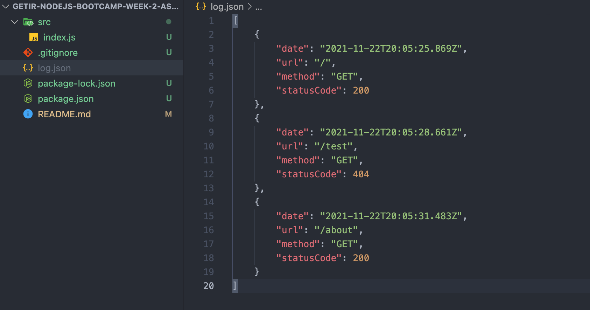

# week-2-assignment

Bu proje kullanıcı tarafından gönderilen http isteklerini log.json dosyasına kaydetmektedir.

### Yükleme

git clone komutunu kullanarak projenin kaynak kodlarını bilgisayarınıza indirebilirsiniz.

```
git clone https://github.com/getir-nodejs-bootcamp/getir-nodejs-bootcamp-week-2-assignment-nebisin.git
```

### Kullanım

1. Projenin bulunduğu konuma gidin.

```
cd getir-nodejs-bootcamp-week-2-assignment-nebisin
```

2. Uygulamayı çalıştırın

```
npm run start
```

3. Tarayıcınızı kullanarak aşağıdaki sayfalardan birini veya birkaçını ziyaret edin

```
http://localhost:3000/
http://localhost:3000/about
http://localhost:3000/contact
```

4. 404 hatasını test etmek için yukarıdaki listede mevcut olmayan bir sayfaya gidin

```
Örneğin: http://localhost:3000/404
```

5. Kaydedilen logları görmek için projenin ana dizininde oluşturulan log.json dosyasını kontrol edin.



### Katkıda Bulunmak

Eğer bir hata ile karşılaşırsanız veya katkıda bulunmak isterseniz [yeni bir issue açabilirsiniz](https://github.com/getir-nodejs-bootcamp/getir-nodejs-bootcamp-week-2-assignment-nebisin/issues/new).

<br />

© Salim Bozok ([GitHub](https://github.com/nebisin) - [Linkedin](https://www.linkedin.com/in/salimbozok/) - <salimbozok@outlook.com>)
